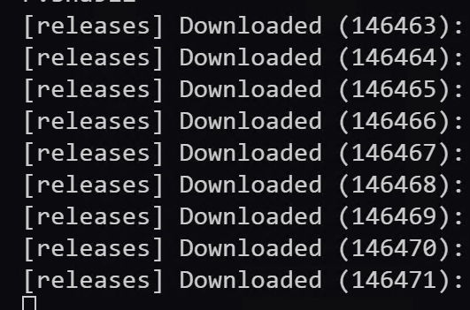

# Nexus 3 仓库导出工具

这是一个用于从 Nexus 3 仓库导出所有构件的 Python 脚本工具。它支持异步下载，可以高效地导出 Nexus 仓库中的所有构件。

## 功能特点

- 支持异步下载，提高导出效率
- 自动创建目录结构
- 显示下载进度
- 支持断点续传（跳过已下载的文件）
- 详细的日志记录
- 支持多仓库导出
- 显示下载统计信息

## 环境要求

- Python 3.4 或更高版本
- 网络连接（用于访问 Nexus 服务器）

## 安装步骤

1. 克隆或下载本项目
2. 安装依赖包：
   ```bash
   pip install -r requirements.txt
   ```

## 配置说明

在使用前，请修改 `script.py` 中的以下配置：

```python
NEXUS_URL = "http://localhost:8081"  # Nexus 服务器地址
USERNAME = "admin"                   # Nexus 用户名
PASSWORD = "admin123"                # Nexus 密码
BASE_OUTPUT_DIR = "nexus_artifacts"  # 导出文件的基础目录
MAX_CONCURRENT_DOWNLOADS = 10        # 最大并发下载数
```

## 使用方法

1. 确保已正确配置 Nexus 服务器地址和认证信息
2. 运行脚本：
   ```bash
   python script.py
   ```
3. 脚本会自动：
   - 连接到 Nexus 服务器
   - 获取所有仓库列表
   - 逐个仓库导出构件
   - 显示下载进度和统计信息

## 输出说明

- 所有导出的文件将保存在 `BASE_OUTPUT_DIR` 指定的目录下
- 每个仓库的文件将保存在对应的子目录中
- 日志文件 `nexus_export.log` 将记录详细的导出过程
- 控制台将显示实时下载进度和统计信息

## 注意事项

- 确保有足够的磁盘空间
- 确保网络连接稳定
- 建议在非高峰期运行导出任务
- 如果中断，可以重新运行脚本，已下载的文件将被跳过

## 许可证

MIT License 

## 测试

